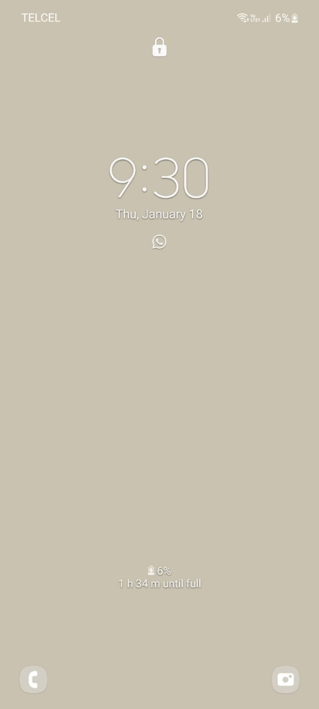
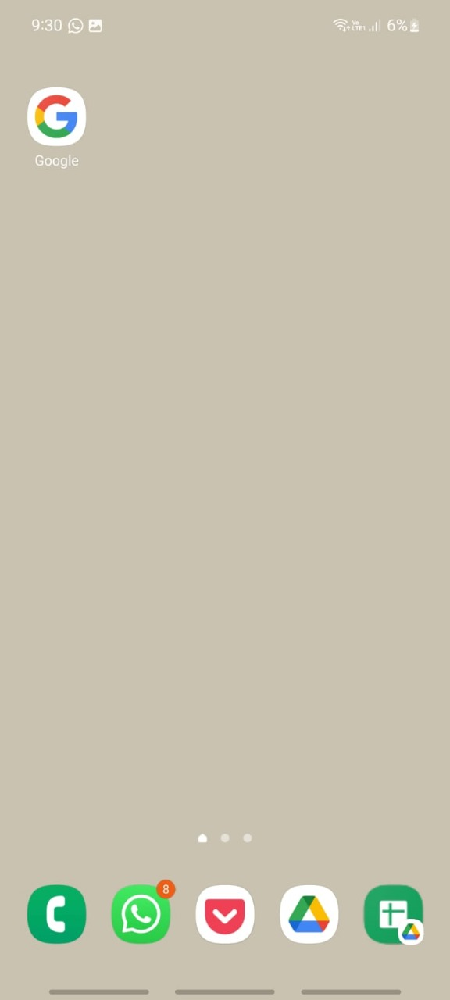
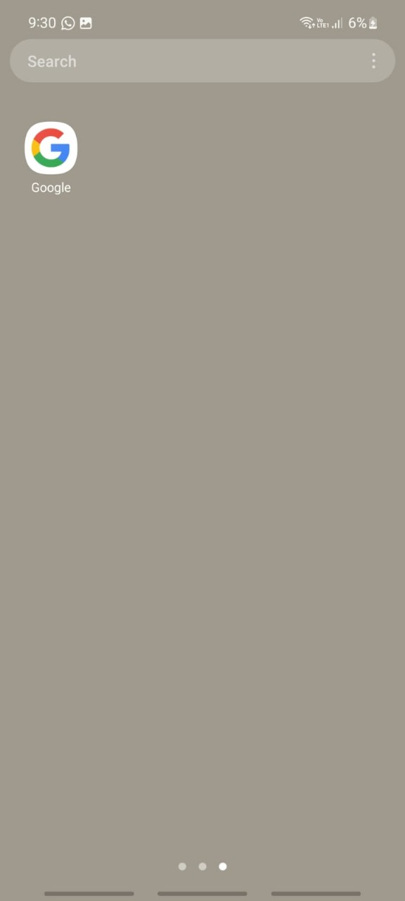
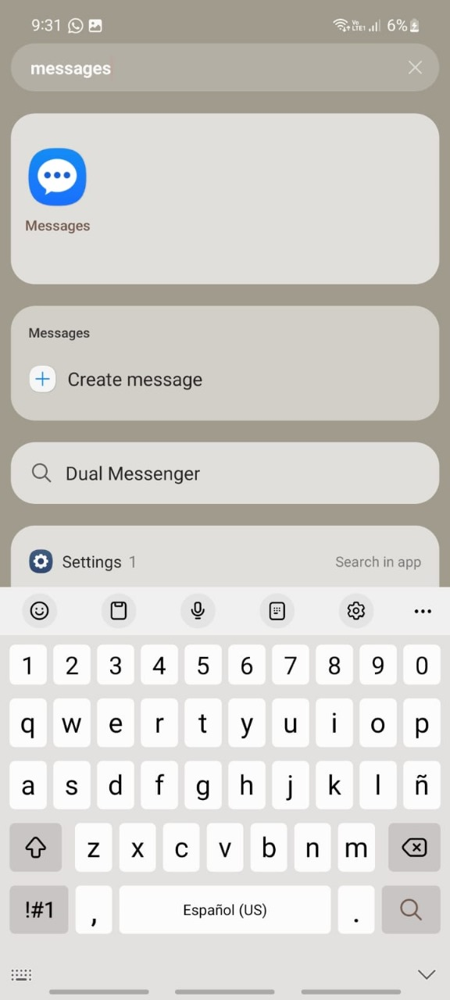
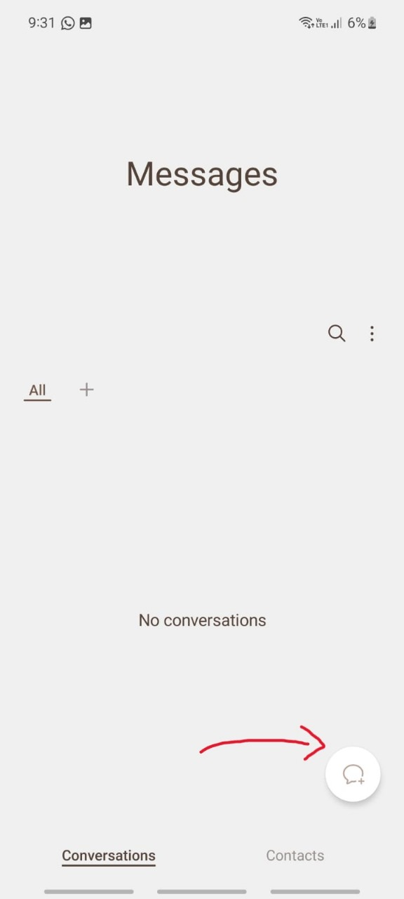
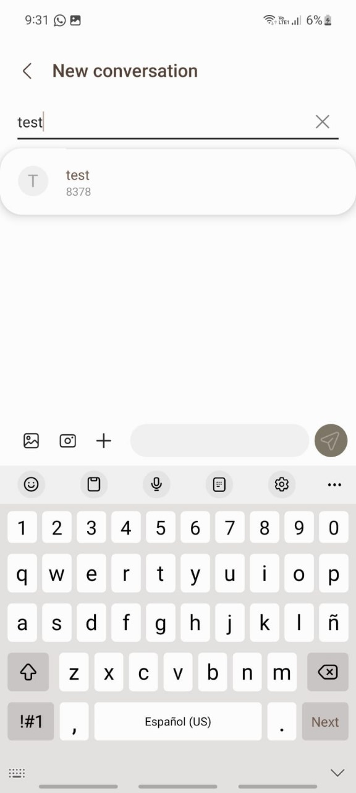
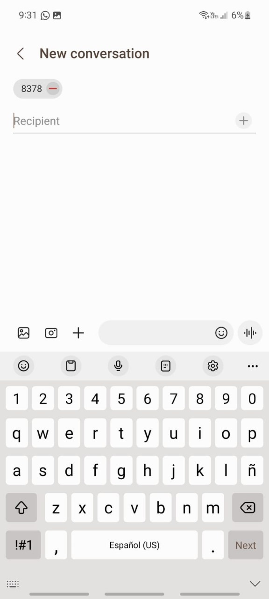
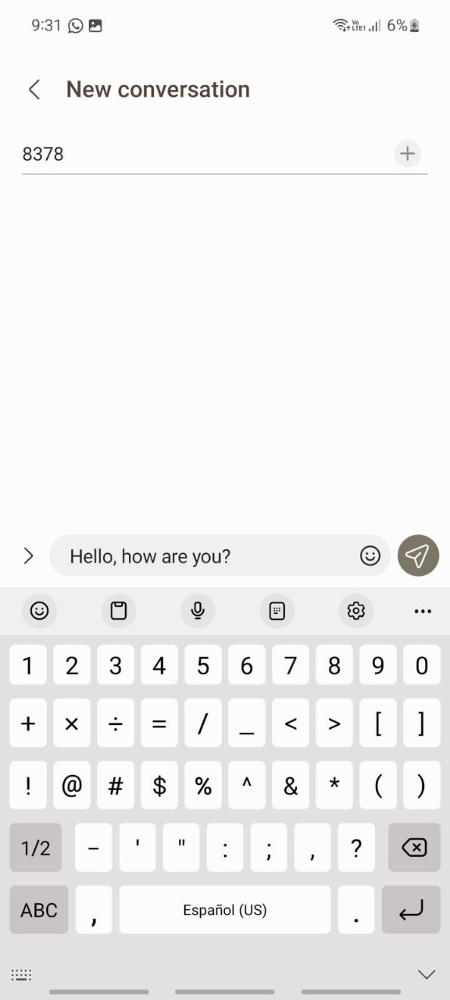
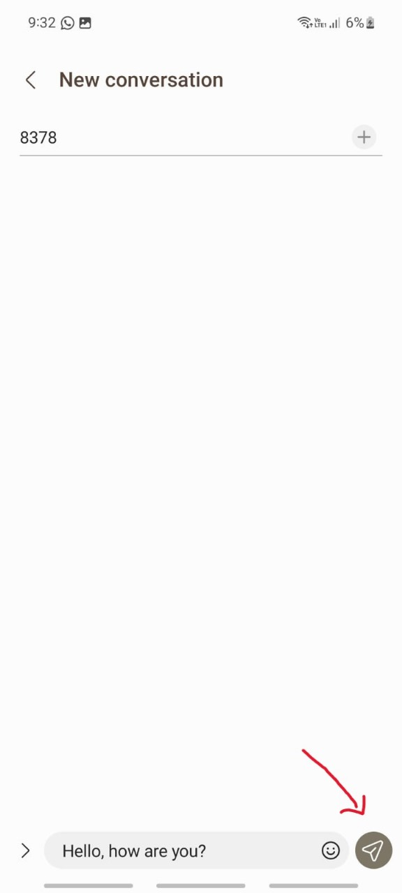

# Index

1. [About this guide](#about-this-guide)
2. [Open the message application](#open-the-message-application)
   1. [Turn on your smartphone](#turn-on-your-smartphone)
   2. [Unlock the smartphone](#unlock-the-smartphone)
   3. [Access the “Search bar” for Samsung](#access-the-search-bar-for-samsung)
   4. [Write on the “Search bar”](#write-on-the-search-bar)
2. [Write a new message and Assign a Receiver/Contact](#write-a-new-message-and-assign-a-receivercontact)
   1. [On the Message app, click “+” or “New” button](#on-the-message-app-click--or-new-button)
   2. [On the “New Conversation” screen, write the name of the Receiver/Contact](#on-the-new-conversation-screen-write-the-name-of-the-receivercontact)
   3. [On the bottom section of the screen, click on the empty writing section](#on-the-bottom-section-of-the-screen-click-on-the-empty-writing-section)
   4. [Write the message](#write-the-message)
      - [Add files or images](#add-files-or-images)
3. [Send a new message](#send-a-new-message)
   1. [Follow instructions 1-8 to open, assign a receiver, and write a message](#follow-instructions-1-8-to-open-assign-a-receiver-and-write-a-message)
   2. [Once any given message is in the writing section, the “Send” button will appear](#once-any-given-message-is-in-the-writing-section-the-send-button-will-appear)
   3. [Once ready, click the “Send” button to send the new message](#once-ready-click-the-send-button-to-send-the-new-message)

---

# About this guide

This manual provides a detailed overview of sending a text message from a smartphone. The instructions outlined in this guide can be applied to any smartphone, regardless of the make or model. For illustration, we will be using a Samsung phone.

# Open the Messages application

To open the Messages application on the smartphone, follow the next steps:

1. Turn on your smartphone by clicking the On/Off button.

> For further indications on the On/Off button on any given smartphone, check the User Manual provided by the vendor.
> 
2. Unlock the smartphone to access the main screen.

  
  

 

3. Access the “Search bar” for Samsung by dragging it up from the bottom of your screen.

 

  

4. Write on the “Search bar” the word “message” and then click on the Message app.

  

# Write a new message and Assign a Receiver/Contact

To write a new message and assign a Receiver/Contact on the smartphone, follow the next steps:

5. On the Message app, click “+” or “New” button on the bottom right of the screen. 

  

6. On the “New Conversation” screen, write the name of the Receiver/Contact and click it. Select more than two contacts by writing and selecting each one.

  
  

  

 

7. On the bottom section of the screen, click on the empty writing section to open up the keyboard.

8. Write the message. 
    a. To add files or images, click on the buttons to the left of the writing section.

  

# Send a new message

To send a new message on the smartphone, follow the next steps:

9. Follow instructions 1-8 to open, assign a receiver, and write a message.

10. Once any given message is in the writing section, the “Send” button will appear on the right part of the screen.

  

11. Once ready, click the “Send” button to send the new message.
